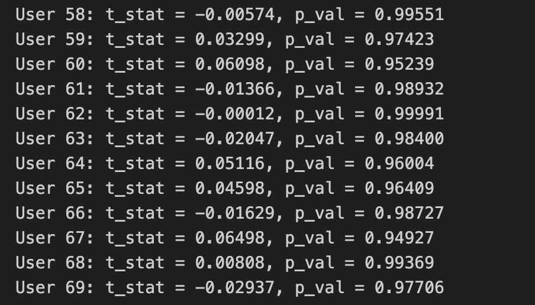

# 🏠 Рекомендательная система для подбора недвижимости v1.0

## 📌 Описание
Этот проект реализует рекомендательную систему, которая помогает пользователям находить подходящие варианты квартир на основе их истории поиска. Система основана модели косинусного сходства для построения персонализированных рекомендаций.

В данной вресии история поиска генерируется на основе выбора пользователем своей социально-экономической группы.
---

## 🧪 Демонстрация


---

## 🛠 Технологии
- Python 3
- Pandas / NumPy
- Scikit-learn 
- FastAPI
- Docker 

## 📁 Структура проекта

```
Rec_systems/
├── data/               # Данные о квартирах и действиях пользователей
├── utils.py            # Реализация модели рекоммендаций и истории просмотра
├── app_api.py          # API (Backend)
├── requirements.txt    # Зависимости
├── streamlit_app.py    # Frontend
└── README.md           # Информация о проекте

```

---

## ▶️ Установка и запуск через Docker
### Предварительные требования:
- [Docker](https://www.docker.com/get-started)


### Шаги:
1. Клонируйте репозиторий:
```bash
git clone https://github.com/kiseleq/Rec_systems.git
cd Rec_systems
```
2. Соберите Docker-образ:
```bash
docker build -t apartment-recommendation-service .
```
3. Запустите контейнер:
```bash
docker run -d --name recommendation_service -p 500:5000 apartment-recommendation-service
```
4. Запустите сайт:й
```bash
streamlit run streamlit_app.py
```


---

## 📊 Полученные результаты
Для оценки модели был проведён t-тест Уэлча для пяти пользователей. Цель — сравнить средние значения сумм нормализованных числовых признаков рекомендованных объектов недвижимости с теми, которые пользователи действительно просматривали.

Результат: при уровне значимости α = 0.1 у всех пяти пользователей не была выявлена статистически значимая разница между рекомендованными и просмотренными объектами.

Итоговая метрика: 98.7% совпадение по критерию отсутствия различий.



---


## 👥 Участники команды

- [Андрей Киселёв](https://github.com/kiseleq) 
- [Елизавета Крылова](https://github.com/ElizavetaWow)
- [Анжелина Абдулаева](https://github.com/)
- [Валерия Писарькова](https://github.com/)

---

